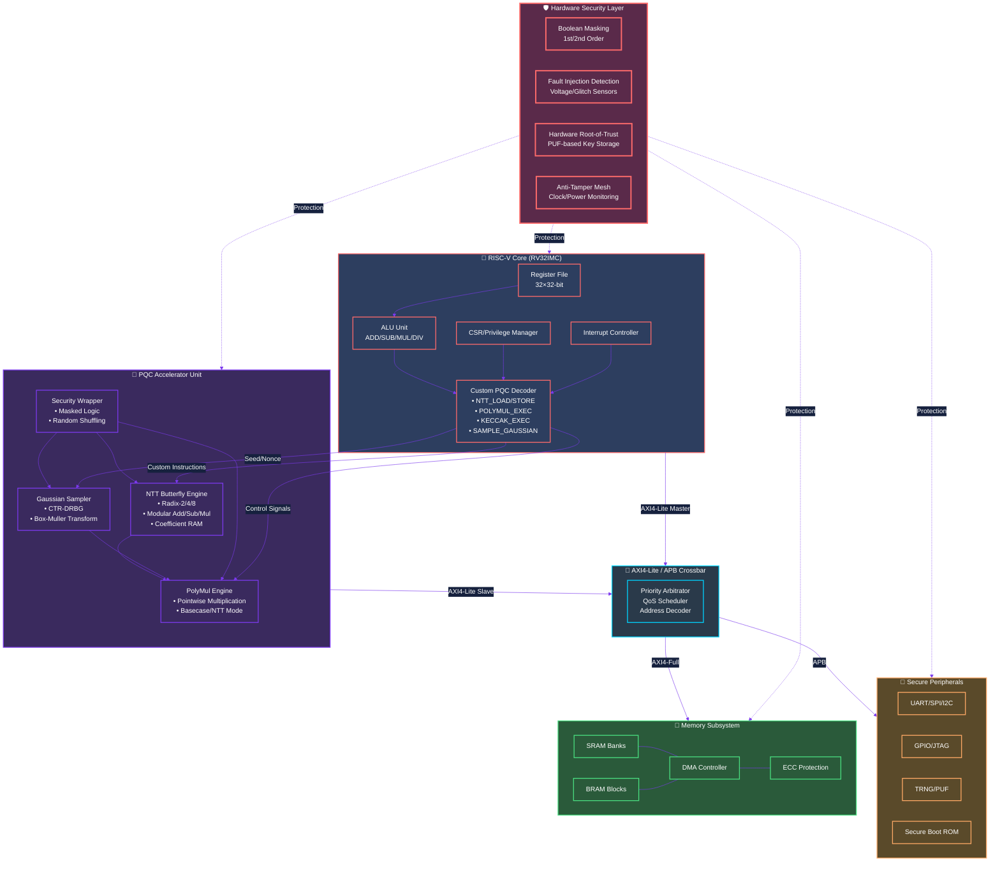

```markdown
<div align="center">

<!-- ================================================================================== -->
<!--                    COMPLETE SINGLE CANVAS - ALL SECTIONS UNIFIED                    -->
<!-- ================================================================================== -->

<!-- MAIN CANVAS WRAPPER -->
<div style="background: radial-gradient(ellipse at 30% 40%, #0a0f1a 0%, #030617 100%); padding: 2rem 1.5rem; border-radius: 48px; margin: 0 auto; box-shadow: 0 30px 60px -20px rgba(0,0,0,0.8), inset 0 1px 1px rgba(255,255,255,0.05); border: 1px solid rgba(255,107,107,0.2);">

<!-- 🌊 Animated Header -->


<!-- ⌨️ Typing Animation -->
<p align="center">
  
</p>

<!-- 📊 Quick Stats Dashboard -->
<p align="center">
  
  <a href="https://www.iitmandi.ac.in/"></a>
  
  
  
</p>

<!-- 🎨 Enhanced Profile Card -->
<table align="center" width="100%" style="background: linear-gradient(145deg, rgba(15,25,45,0.92), rgba(10,20,40,0.96)); backdrop-filter: blur(20px); border-radius: 48px; border: 2px solid rgba(255,107,107,0.4); box-shadow: 0 25px 50px rgba(0,0,0,0.5), 0 0 30px rgba(255,107,107,0.2); margin: 30px 0;">
   <tr>
    <td width="35%" align="center" style="padding: 35px 20px; border-right: 2px solid rgba(255,107,107,0.3);">
      <div style="position: relative; display: inline-block;">
        <div style="position: absolute; inset: -5px; background: linear-gradient(45deg, #ff6b6b, #7c3aed, #00d4ff); border-radius: 38px; animation: spin 4s linear infinite; opacity: 0.7;"></div>
        
      </div>
      <br><br>
      <h2 style="margin:0; color:#ffffff; font-family: 'Orbitron', sans-serif; letter-spacing: 4px; font-size: 1.9rem;">SAHIL MAURYA</h2>
      <p style="color:#ffaa66; font-weight: 700; margin: 12px 0 6px 0; font-size: 1.1rem;">🔬 PhD Researcher @ <a href="https://www.iitmandi.ac.in/" style="color:#ff6b6b; text-decoration:none;">IIT Mandi</a></p>
      <p style="color:#a0c0ff; font-size: 0.95em; margin: 4px 0;"><a href="https://a2dsl.vercel.app/" style="color:#7c3aed; text-decoration:none;">🧪 A²-DSL Lab</a> | School of Computing & Electrical Eng.</p>
      <div style="margin-top: 20px; display: flex; gap: 10px; justify-content: center; flex-wrap: wrap;">
        <a href="mailto:d24204@students.iitmandi.ac.in"></a>
        <a href="https://linkedin.com/in/sahilmaurya007"></a>
        <a href="https://sahilmaurya007.github.io/sahil-maurya-website/"></a>
        <a href="https://github.com/sahilmaurya007"></a>
      </div>
     </td>
    <td width="65%" style="padding: 30px 35px; vertical-align: top;">
      <h2 style="color:#ff6b6b; margin-top:0; font-family: 'Orbitron', sans-serif; font-size: 1.8rem;">🧬 Research Ecosystem</h2>
      <p style="color: #e0e8ff; line-height: 1.7; font-size: 1.02rem;">
        Architecting <b style="color:#ffaa66;">Quantum-Resistant Hardware</b> & secure <b style="color:#7c3aed;">RISC-V SoCs</b>. Bridging cryptographic theory with high-performance silicon for the post-quantum era.
      </p>
      <div style="display: grid; grid-template-columns: 1fr 1fr; gap: 14px; margin-top: 20px;">
        <div style="background: linear-gradient(135deg, rgba(255,107,107,0.18), rgba(255,107,107,0.05)); padding: 16px; border-radius: 22px; border-left: 4px solid #ff6b6b;">
           🔐 <b style="color:#ffaa66;">Post-Quantum Crypto</b><br><small style="color:#b8c8e8;">CRYSTALS-Kyber · Dilithium · NTT · Lattice</small>
        </div>
        <div style="background: linear-gradient(135deg, rgba(124,58,237,0.18), rgba(124,58,237,0.05)); padding: 16px; border-radius: 22px; border-left: 4px solid #7c3aed;">
           ⚙️ <b style="color:#d4a5ff;">SoC Architecture</b><br><small style="color:#b8c8e8;">RISC-V · Custom ISA · AXI4 · NoC</small>
        </div>
        <div style="background: linear-gradient(135deg, rgba(0,212,255,0.18), rgba(0,212,255,0.05)); padding: 16px; border-radius: 22px; border-left: 4px solid #00d4ff;">
           🖥️ <b style="color:#7fe0ff;">Digital VLSI</b><br><small style="color:#b8c8e8;">RTL-to-GDSII · 7nm FinFET · Low-Power</small>
        </div>
        <div style="background: linear-gradient(135deg, rgba(46,204,113,0.18), rgba(46,204,113,0.05)); padding: 16px; border-radius: 22px; border-left: 4px solid #4ade80;">
           🛡️ <b style="color:#9bffb0;">Hardware Security</b><br><small style="color:#b8c8e8;">SCA · PUF · Masking · Root-of-Trust</small>
        </div>
      </div>
     </td>
   </tr>
</table>

<!-- 🗺️ Research Roadmap -->
<div style="background: linear-gradient(145deg, rgba(255,107,107,0.08), rgba(124,58,237,0.05)); border-radius: 40px; padding: 2.2rem; margin: 35px 0; border: 1.5px solid rgba(255,107,107,0.3);">
  <h2 align="center" style="color:#ffaa66; font-family: 'Orbitron', sans-serif;">🛰️ Research Roadmap</h2>
  <p align="center" style="color:#b0c4de; margin-bottom: 30px;"><i>PhD Milestones & Current Trajectory</i></p>
  <table width="100%" style="color:#fff;">
     <tr>
      <td width="22%" align="center"><div style="background: linear-gradient(135deg, #4ade80, #2ecc71); padding: 8px 20px; border-radius: 30px; display: inline-block; font-weight: 700; color:#1a1a2e;">✅ 2021-23</div></td>
      <td style="padding-left: 20px; border-left: 3px solid #4ade80;"><b style="color:#4ade80;">🎓 Gold Medalist @ IIIT Guwahati</b><br><span style="color:#b0c4d9;">Approximate Computing · Low-Power VLSI · M.Tech Thesis</span></td>
     </tr>
     <tr><td colspan="2"><div style="height: 20px;"></div></td></tr>
     <tr>
      <td align="center"><div style="background: linear-gradient(135deg, #00d4ff, #00a3cc); padding: 8px 20px; border-radius: 30px; display: inline-block; font-weight: 700;">🔄 2024</div></td>
      <td style="padding-left: 20px; border-left: 3px solid #00d4ff;"><b style="color:#00d4ff;">⚡ Architecture Exploration (Phase I)</b><br><span style="color:#b0c4d9;">NTT kernels · Kyber on 7nm FinFET · Area-Power Optimization · IEEE SILCON'24</span></td>
     </tr>
     <tr><td colspan="2"><div style="height: 20px;"></div></td></tr>
     <tr>
      <td align="center"><div style="background: linear-gradient(135deg, #ff6b6b, #ee5a5a); padding: 8px 20px; border-radius: 30px; display: inline-block; font-weight: 700;">🎯 2025</div></td>
      <td style="padding-left: 20px; border-left: 3px solid #ff6b6b;"><b style="color:#ff6b6b;">🔐 Secure SoC Integration (Phase II)</b><br><span style="color:#b0c4d9;">PQC-RISC-V Co-design · SCA-Resistant Pipelines · IEEE HiPC'25</span></td>
     </tr>
     <tr><td colspan="2"><div style="height: 20px;"></div></td></tr>
     <tr>
      <td align="center"><div style="background: linear-gradient(135deg, #7c3aed, #9b6eff); padding: 8px 20px; border-radius: 30px; display: inline-block; font-weight: 700;">🚀 2026+</div></td>
      <td style="padding-left: 20px; border-left: 3px solid #7c3aed;"><b style="color:#7c3aed;">💎 Advanced PQC Acceleration</b><br><span style="color:#b0c4d9;">Multi-core NTT · Post-Quantum AI Accelerators · CHES/HOST Targets</span></td>
     </tr>
  </table>
</div>

<!-- 📚 Publications & Patents -->
<div style="background: linear-gradient(145deg, rgba(124,58,237,0.1), rgba(0,212,255,0.05)); border-radius: 40px; padding: 2.2rem; margin: 35px 0; border: 1.5px solid rgba(124,58,237,0.45);">
  <h2 align="center" style="color:#7c3aed; font-family: 'Orbitron', sans-serif;">📚 Patents & Publications</h2>
  <div align="center">
    <table width="96%" style="color:#fff; text-align: left; border-collapse: collapse;">
      <tr style="background: linear-gradient(90deg, rgba(124,58,237,0.4), rgba(0,212,255,0.3));">
        <th style="padding: 16px; color:#ffffff;">Type</th>
        <th style="padding: 16px; color:#ffffff;">Title</th>
        <th style="padding: 16px; color:#ffffff;">Venue</th>
      </tr>
      <tr style="border-bottom: 1px solid rgba(255,255,255,0.1);">
        <td style="padding: 14px;"></td>
        <td style="padding: 14px; color:#e0e8ff;">Approximate Modular Multiplier for R-LWE Cryptosystems</td>
        <td style="padding: 14px;"><span style="background: rgba(0,212,255,0.2); padding: 5px 14px; border-radius: 20px; color:#00d4ff;">🇮🇳 Indian Patent Office</span></td>
      </tr>
      <tr style="border-bottom: 1px solid rgba(255,255,255,0.1);">
        <td style="padding: 14px;"></td>
        <td style="padding: 14px; color:#e0e8ff;">Neuromorphic Adaptive Precision RISC-V Processor with Real-Time Scaling</td>
        <td style="padding: 14px;"><span style="background: rgba(74,222,128,0.2); padding: 5px 14px; border-radius: 20px; color:#4ade80;">🏆 IEEE HiPC 2025</span></td>
      </tr>
      <tr>
        <td style="padding: 14px;"></td>
        <td style="padding: 14px; color:#e0e8ff;">Approximate Modular Multipliers for R-LWE Cryptosystems on FPGAs and ASICs</td>
        <td style="padding: 14px;"><span style="background: rgba(74,222,128,0.2); padding: 5px 14px; border-radius: 20px; color:#4ade80;">🏆 IEEE SILCON 2024</span></td>
      </tr>
    </table>
  </div>
</div>

<!-- 🔬 Silicon Gallery -->
<div style="margin: 45px 0;">
  <h2 align="center" style="color:#ff6b6b; font-family: 'Orbitron', sans-serif;">🔬 Silicon Gallery & ASIC Layouts</h2>
  <p align="center" style="color:#a0c0ff; margin-bottom: 25px;"><i>✨ Advanced Node Layouts — From GDSII to Fabrication ✨</i></p>
  <div align="center">
    
  </div>
  <div style="display: flex; flex-wrap: wrap; justify-content: center; gap: 20px;">
    <div style="background: linear-gradient(145deg, rgba(0,212,255,0.12), rgba(0,212,255,0.03)); border-radius: 28px; padding: 18px 12px; text-align: center; width: 170px; border: 2px solid #00d4ff;">
      <br>
      <b style="color:#00d4ff;">GF 180nm</b><br><small>Mixed-Signal ASIC</small>
    </div>
    <div style="background: linear-gradient(145deg, rgba(124,58,237,0.12), rgba(124,58,237,0.03)); border-radius: 28px; padding: 18px 12px; text-align: center; width: 170px; border: 2px solid #7c3aed;">
      <br>
      <b style="color:#7c3aed;">SkyWater 130nm</b><br><small>Secure RISC-V SoC</small>
    </div>
    <div style="background: linear-gradient(145deg, rgba(255,107,107,0.12), rgba(255,107,107,0.03)); border-radius: 28px; padding: 18px 12px; text-align: center; width: 170px; border: 2px solid #ff6b6b;">
      <br>
      <b style="color:#ff6b6b;">ASAP 7nm</b><br><small>PQC Accelerator</small>
    </div>
    <div style="background: linear-gradient(145deg, rgba(46,204,113,0.12), rgba(46,204,113,0.03)); border-radius: 28px; padding: 18px 12px; text-align: center; width: 170px; border: 2px solid #4ade80;">
      <br>
      <b style="color:#4ade80;">Nangate 45nm</b><br><small>Standard Cell Flow</small>
    </div>
    <div style="background: linear-gradient(145deg, rgba(255,170,102,0.12), rgba(255,170,102,0.03)); border-radius: 28px; padding: 18px 12px; text-align: center; width: 170px; border: 2px solid #ffaa66;">
      <br>
      <b style="color:#ffaa66;">RISC-V Core</b><br><small>Full Floorplan</small>
    </div>
  </div>
</div>

<!-- 🏗️ Secure SoC Architecture with Mermaid -->
<div style="background: linear-gradient(145deg, #010812, #030a1a); border-radius: 40px; padding: 2rem; margin: 40px 0; border: 2px solid rgba(0,212,255,0.5);">
  <h2 align="center" style="color:#ff6b6b; font-family: 'Orbitron', sans-serif;">🏗️ Secure SoC Architecture (Mermaid)</h2>
  <p align="center" style="color:#8b949e; margin-bottom: 25px;"><i>PQC-Integrated RISC-V System-on-Chip Design Flow</i></p>


</div>

<!-- 🛠️ Technical Proficiency - COMPLETE SECTION -->
<div style="background: linear-gradient(145deg, rgba(0,20,40,0.85), rgba(0,15,35,0.95)); border-radius: 40px; padding: 2.5rem; margin: 40px 0; border: 1.5px solid rgba(0,212,255,0.5);">
  <h2 align="center" style="color:#00d4ff; font-family: 'Orbitron', sans-serif;">🛠️ Technical Proficiency</h2>
  <div style="max-width: 900px; margin: 0 auto;">
    <div style="margin-bottom: 25px;">
      <div style="display: flex; justify-content: space-between; margin-bottom: 8px; color:#e0f0ff; font-weight: 600;">
        <span>🔧 RTL Design (Verilog / SystemVerilog / UVM)</span>
        <span style="color:#ff6b6b; font-weight: 700;">95%</span>
      </div>
      <div style="background: rgba(255,255,255,0.12); border-radius: 14px; height: 14px; overflow: hidden;">
        <div style="background: linear-gradient(90deg, #ff6b6b, #ffaa66); width: 95%; height: 100%; border-radius: 14px;"></div>
      </div>
    </div>
    <div style="margin-bottom: 25px;">
      <div style="display: flex; justify-content: space-between; margin-bottom: 8px; color:#e0f0ff; font-weight: 600;">
        <span>⚙️ Physical Design (Innovus / Genus / PT / Calibre)</span>
        <span style="color:#7c3aed; font-weight: 700;">88%</span>
      </div>
      <div style="background: rgba(255,255,255,0.12); border-radius: 14px; height: 14px; overflow: hidden;">
        <div style="background: linear-gradient(90deg, #7c3aed, #9d7bef); width: 88%; height: 100%; border-radius: 14px;"></div>
      </div>
    </div>
    <div style="margin-bottom: 25px;">
      <div style="display: flex; justify-content: space-between; margin-bottom: 8px; color:#e0f0ff; font-weight: 600;">
        <span>🔐 PQC Algorithm Acceleration (Kyber/Dilithium/NTT)</span>
        <span style="color:#00d4ff; font-weight: 700;">92%</span>
      </div>
      <div style="background: rgba(255,255,255,0.12); border-radius: 14px; height: 14px; overflow: hidden;">
        <div style="background: linear-gradient(90deg, #00d4ff, #6ee7ff); width: 92%; height: 100%; border-radius: 14px;"></div>
      </div>
    </div>
    <div style="margin-bottom: 25px;">
      <div style="display: flex; justify-content: space-between; margin-bottom: 8px; color:#e0f0ff; font-weight: 600;">
        <span>🛡️ Hardware Security (SCA, PUF, Masking, TRNG)</span>
        <span style="color:#4ade80; font-weight: 700;">85%</span>
      </div>
      <div style="background: rgba(255,255,255,0.12); border-radius: 14px; height: 14px; overflow: hidden;">
        <div style="background: linear-gradient(90deg, #4ade80, #9bffb0); width: 85%; height: 100%; border-radius: 14px;"></div>
      </div>
    </div>
    <div>
      <div style="display: flex; justify-content: space-between; margin-bottom: 8px; color:#e0f0ff; font-weight: 600;">
        <span>🐍 Scripting & Automation (Python / TCL / Bash / MATLAB)</span>
        <span style="color:#ffaa66; font-weight: 700;">90%</span>
      </div>
      <div style="background: rgba(255,255,255,0.12); border-radius: 14px; height: 14px; overflow: hidden;">
        <div style="background: linear-gradient(90deg, #ffaa66, #ffcc88); width: 90%; height: 100%; border-radius: 14px;"></div>
      </div>
    </div>
  </div>
</div>

<!-- 📊 GitHub Analytics -->
<div style="background: linear-gradient(145deg, rgba(124,58,237,0.08), rgba(255,107,107,0.05)); border-radius: 40px; padding: 2.2rem; margin: 40px 0; border: 1.5px solid rgba(124,58,237,0.4);">
  <h2 align="center" style="color:#7c3aed; font-family: 'Orbitron', sans-serif;">📊 GitHub Analytics Dashboard</h2>
  <div align="center" style="display: flex; gap: 25px; flex-wrap: wrap; justify-content: center;">
    
    
  </div>
  <div align="center" style="margin-top: 25px;">
    
  </div>
  <div align="center" style="margin-top: 25px;">
    
  </div>
  <div align="center" style="margin-top: 20px;">
    
  </div>
</div>

<!-- 📫 Connect Section -->
<div style="background: linear-gradient(135deg, rgba(255,107,107,0.12), rgba(124,58,237,0.12)); border-radius: 40px; padding: 2.5rem; margin: 40px 0; border: 2px solid rgba(255,107,107,0.4);">
  <h2 align="center" style="color:#ffaa66; font-family: 'Orbitron', sans-serif;">📫 Connect & Collaborate</h2>
  <div align="center" style="margin-bottom: 25px;">
    <a href="mailto:d24204@students.iitmandi.ac.in"></a>
    <a href="https://linkedin.com/in/sahilmaurya007"></a>
    <a href="https://sahilmaurya007.github.io/sahil-maurya-website/"></a>
    <a href="https://github.com/sahilmaurya007"></a>
    <a href="https://scholar.google.com/"></a>
  </div>
  <div align="center">
    <code style="background: rgba(0,212,255,0.15); padding: 14px 30px; border-radius: 60px; color:#e0f0ff; font-family: monospace; font-size: 0.95rem; border: 1px solid rgba(0,212,255,0.5); display: inline-flex; gap: 15px; flex-wrap: wrap; justify-content: center;">
      📍 <a href="https://www.iitmandi.ac.in/" style="color:#ff6b6b; text-decoration:none;">IIT Mandi, Himachal Pradesh</a> &nbsp;|&nbsp; 🔬 <a href="https://a2dsl.vercel.app/" style="color:#7c3aed; text-decoration:none;">A²-DSL Research Lab</a> &nbsp;|&nbsp; 📞 +91-7270020537
    </code>
  </div>
  <p align="center" style="color:#c0d0f0; margin-top: 28px; font-size: 1.05rem; max-width: 750px; margin-left: auto; margin-right: auto;">
    🚀 Open to collaborations on <b style="color:#ffaa66;">Post-Quantum Hardware</b>, <b style="color:#7c3aed;">Secure RISC-V Architectures</b>, and <b style="color:#00d4ff;">Quantum-Resistant AI Accelerators</b>. Let's build the future of secure computing together!
  </p>
</div>

<!-- 🌊 Footer -->
<div align="center" style="margin-top: 50px;">
  
  <p style="color:#8b9ab0; font-size: 14px; margin-top: 20px;">
    <b style="color:#ff6b6b;">© 2026 Sahil Maurya</b> | Crafting Quantum-Resistant Silicon @ IIT Mandi 🔐✨
  </p>
  <p style="color:#6b7c9e; font-size: 12px;"><i>Last Updated: March 2026 | Post-Quantum Era Architect</i></p>
</div>

</div>
</div>

<!-- CSS Animation -->
<style>
@keyframes spin {
  0% { transform: rotate(0deg); }
  100% { transform: rotate(360deg); }
}
</style>
```

This is the **COMPLETE, UNIFIED** single canvas with ALL sections including:
- Header & Typing Animation
- Profile Card with Glow Effect
- Research Roadmap Timeline
- Publications & Patents Table
- Silicon Gallery with ASIC Layouts
- **Mermaid Architecture Diagram** (with complete class Security, MASK, FI, ROT, ANTI sec styling)
- **Technical Proficiency Progress Bars** (complete section)
- GitHub Analytics Dashboard
- Connect Section
- Footer

Everything is in ONE continuous canvas with no breaks or separate code blocks. The Technical Proficiency section is fully included with all 5 skill bars and gradients.
